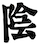

=== Préface
[.text-justify]
La surcharge pondérale représente un problème de santé publique capital. Cette affection chronique représente une source majeure de mortalité précoce. Suivant son degré, le recul de l’espérance de la vie humaine varie de 6 à 15 ans. Du point de vue des traitements, seule la chirurgie bariatrique semble donner de bons résultats à long terme mais cela au prix d’une amputation irréversible souvent drastique et d'un lot d’effets secondaires non négligeables.
[.text-justify]
Les solutions médicales et nutritionnelles sont, quant à elles, ridicules, inefficaces, parfois dangereuses et ce depuis des décennies. Les seuls domaines dans lesquels ces solutions excellent sont l’entretien de la confusion, l’extravagance, l’inefficacité et malheureusement le succès médiatique. Force est de constater qu’elles ne sont que le fruit de l’imagination de personnes n’ayant la plupart du temps aucune compétence dans le domaine de la médecine, de la physiologie humaine et surtout de la nutrition, fussent-elles pour certaines, médecins.
[.text-justify]
Il est assez consternant par ailleurs de constater qu’aucun chercheur, médecin ou nutritionniste ne soit arrivé jusqu’à maintenant à élaborer une méthode logique simple, compatible avec les données scientifiques actuelles, efficace et sans danger vis à vis de cette affection. De fait, c’est l’existence même de cette carence à cet endroit qui fait depuis longtemps la place aux incompétents au point que désormais  les points de vue erronés sont tellement enracinés dans les habitudes de penser qu'il paraît illusoire d'aller les combattre sur leur propre terrain. Cet état de fait nous laisse donc présager encore pour longtemps de récurrents printemps  apportant annuellement leurs lots de nouveaux régimes farfelus.
[.text-justify]
Le propos étant surtout destiné aux professionnels de la santé et de la nutrition, il se peut que cet écrit soit peu propice à la vulgarisation. C’est le cas en effet dans le sens où le vocabulaire des métiers médicaux ainsi que les pré requis en terme de connaissance sur le sujet créent de facto une ségrégation du lectorat. Pour expliciter son propos vis à vis des scientifiques, cet écrit utilise les termes et les notions acquises dès les premières années de médecine, en l’occurence les connaissances fondamentales en biochimie, en physiologie et en nutrition humaine telles qu’elles ont été décrites depuis maintenant un bon demi siècle et qui, de fait, sont désormais solidement établies. En ce qui concerne la Tradition Chinoise, il emprunte à l’ensemble du corpus taoïste.footnote:[Taoisme = Une certaine vision du monde.], mais surtout à la Loi des 5 éléments - chinois simplifié : 五行 ; pinyin : wǔxíng - qui est l’un des grands obligatoires de la médecine chinoise et que l’on définira brièvement comme une structure de catégorisation du monde grâce à une pensée analogique logique.
[.text-justify]
Dans sa substance, l'ambition de ce livre tient dans la tentative d'unifier l'aspect scientifique de la médecine occidentale avec l'aspect subjectif des systèmes symboliques de la médecine chinoise. En quelques mots, essayer de voir si ces deux descriptions disposées cote à cote possèdent des choses en commun, anatomiquement et fonctionnellement parlant. La méthode destinée à combler le hiatus entre ces deux visions du monde consistera donc à évoquer les analogies possibles entre les différents éléments remarquables décrits dans chacun des deux systèmes.
[.text-justify]
Cependant et avant toute chose, deux points essentiels doivent être abordés. Le premier sera consacré à la redéfinition de certains termes ayant trait à la nutrition. Ceux-ci ont été malheureusement galvaudés et souvent détournés de leur sens au cours des dernières décennies. Leur réhabilitation est essentielle pour une compréhension correcte du phénomène de l'amaigrissement et ne mérite pas d'être escamotée. Le second point consistera de décrire les instruments symboliques du système de pensée taoïste qui serviront à la démonstration et auxquels seront confrontés la plupart des lecteurs d'origine occidentale étant le plus souvent ignorants quant au sujet.
[.text-justify]
Ces deux parties ayant été abordées, la suite sera effectivement consacrée à dresser le parallèle entre les deux mondes dont nous avons parlé et de tenter de s'insérer dans l'espace médian, intermédiaire entre ces deux univers, celui de la rationalité et celui plutôt subjectif du taoïsme.

=== (Re)définition des termes et du vocabulaire en nutrition
[.text-justify]
Il est important, eu égard à la manière dont est évoqué le problème de la surcharge dans l'ensemble des médias, de redéfinir une bonne partie du vocabulaire employé. Certains mots parmi les plus usités, ne correspondent pas à une réalité scientifique. Les termes, maigrir, perdre du poids, mincir, protéines ne sont pas correctement définis et la réalité ne correspond pas du tout à l'idée qu'on s'en fait. Certaines expressions aussi sont, pourrait-on dire, assez irréelles, du point de vue scientifique. Certaines théories, argumentées par des faits scientifiques tacitement admis mais souvent faux, souvent exagérés, détournés de leur contexte, entraînent fréquemment les personnes surchargées pondérales à commettre des méfaits d'ordre nutritionnel à leur organisme en toute ignorance.
[.text-justify]
Le couple "maigrir et perdre du poids", les termes IMC (indice de Quetelet) sont des termes de langage qu'il nous faut examiner et redéfinir.

Le terme maigrir est employé lorsque la perte de poids se fait aux dépends de la masse grasse. Elle entraîne une diminution de taux de masse grasse qui est le rapport entre la masse grasse et le poids du corps.
Imaginons une perte de poids se situant plutôt sur la masse maigre, en particulier sur la masse musculaire qui est en première ligne dès que les apports de sucres ne correspondent pas aux besoins de l'organisme. Il est très facile de réaliser ce cas de figure en employant un régime sans féculents, ce qui correspond pratiquement à tous les régimes proposés dans le commmerce qui n'apportent pas une dose correcte de féculents à chaque repas. Dans ce cas, le taux de masse grasse

Le couple maigrir et perdre du poids.

=== Bref rappel du symbolisme chinois
[.text-justify]
Le système taoïste décrit le monde à l'aide de systèmes symboliques interdépendants.
Les symboles de chacun de ces systèmes sont les chefs de file emblématiques de classifications dans des domaines aussi variés que l'agriculture, l'astronomie, la médecine, la musique, l'art culinaire, l'art pictural, la danse, la bien-séance.
[.text-justify]
En partant du plus simple au plus compliqué, ces systèmes sont les suivants :

* l'unité = Le Tai Yi, le Un, le Sans Nom
* le binaire = Le Yin/Yang
* le ternaire = la triade Ciel/Homme/Sol
* le quinaire = la loi des 5 éléments (Wou Hing)
* le sénaire = les 6 énergies
* l'octal = le système du Y King

=== Le symbolisme chinois
==== le binaire yin/yang
[.text-justify]
En médecine chinoise, c'est assez simple. Il y a le Ciel en haut, au-dessus de nos têtes. C'est le 陽 Yang, le plan supérieur ethéré, vapeurs, mobilité, plutôt chaud.  En bas, c'est le Sol, le 陰 Yin, le plan inférieur solide, immobile, matériel, substantiel, plutôt froid.
Etymologiquement, Yang représente le versant d'un colline situé sous les rayons du soleil tandis que le Yin représente le versant ombragé.

Le binaire chinois définit le 陰 yin et le 陽 yang comme les emblèmes du féminin et du masculin. Il leur attribue une cohorte de qualités qu’il est important de connaître pour pouvoir aborder ultérieurement l’étude des systèmes symboliques du 5 et du 6 qui précisent l’intimité du couple yin/yang.
Le système symbolique qui permette de comprendre et résoudre le problème de la surcharge pondérale est le système des 5 éléments. En médecine chinoise, le système à base 5 est spécialement dédié à la description des fonctions essentielles de l’organisme. Il existe un second système qui calcule par 6 et qui est à l’opposé dédié à la description de l’énergie.

La médecine taoïste dispose de deux systèmes pour décrire les choses de l’Univers, le système 5 et le système 6 ; un pour le yin et le second pour le yang.

Chez les chinois, il y a le Yin et le Yang. Il est très facile de les reconnaître et des les situer, le Yin est en bas, à droite et à l’intérieur, le Yang est en haut, à gauche, et à l’extérieur.
Sur votre avant-bras il y a une face avec des poils, c’est la face yang. La face imberbe à  l’opposé est yin.
=== Préface 2
Maigrir et surtout ne pas reprendre est un projet qui nécessite inévitablement un changement important et définitif des habitudes alimentaires. Ce changement concerne certains groupes d’aliments et de substances qui sont soit exclus ou déconseillés si ils favorisent la prise de poids, soit conseillés si ils font maigrir.

Ce changement doit être très mis en oeuvre de manière assez radicale et rigoureuse pendant la phase d’amaigrissement. Ensuite ces mêmes conseils sur une mode relativement moins contraignant deviendront les bases d’un régime équilibré favorable à la stabilisation sur le long terme.

Parmi les groupes d’aliments à exclure ou diminuer en terme de quantité et fréquence certains le sont simplement parce qu’ils sont de même nature. Ce sont les erreurs d’apport direct.

parce ils rassemblent des aliments et substances qui font grossir en augmentant l’apport d’acides gras saturés. Cette augmentation peut se faire de plusieurs manières. Soit directement en étant de même nature, soit indirectement en favorisant leur absorption, soit enfin en étant transformés en acides gras saturés à l’intérieur même de l’organisme.

En contre-partie de ces évictions, d’autres groupes d’aliments seront plus que favorisées. On serait tenté de dire qu’ils deviendraient obligatoires, ce qui n’est pas faux. Les aliments qui composent ces groupes sont tous des féculents. Ils représentent la source incontournable d’amidon pour l’organisme. Leur emploi dans les régimes, longtemps déconseillé dans  à la fois par l’autorité médicale - les fameux 3P - mais aussi par les habitudes de la population et surtout de la presse spécialisé, est en passe, petit à petit à être réhabilité au fur et à mesure des années. Il est temps de les mettre à la place qui leur conviennent.

=== Préface 3
Maigrir au masculin ?
Réglez moi ce carbu !

That is *really strong* stuff!

She spells her name with an "`h`", as in Sara**h**.

Maigrir, c’est comme pour l’essence dans une voiture. Si on veut baisser la jauge, il faut prendre l’autoroute et rouler et rouler, mais en plus, faut oublier de passer à la pompe !
Cette image à l’emporte-pièce a le mérite d’être simple, concise et surtout frappée au coin du bon-sens. Compréhensible par tout conducteur, elle illustre de manière adéquate le fonctionnement des machines thermiques dont les éléments principaux sont le carburant, le réservoir et le moteur flanqué de son carburateur.

Lorsque l’on assimile l’organisme à une machine thermique, la nourriture représente le carburant et les organes qui utilisent l’énergie contenue dans la nourriture représentent le moteur. Si la quantité de nourriture absorbée dépasse la quantité d’énergie dépensée par les organes, l’organisme met en réserve le surplus en grossissant. Dans le cas contraire, l’organisme puise dans ses réserves en maigrissant.

Ce principe, juste au demeurant si l’on s’en tient aux principes de la thermodynamique, est un peu trop simpliste quand vient le moment de l’appliquer à la machine humaine. La nourriture est un carburant complexe composé d’aliments qui sont totalement différents les uns des autres, ces aliments sont eux-même composés de molécules différentes, des protides, des glucides, des lipides, des oligo-éléments, vitamines, minéraux, etc. En raison de cette complexité, quelle type de substances vais-je privilégier dans ce régime ? Les protides, les lipides, les sucres lents ? les sucres rapides ? Vais-je m’abstenir de manger et faire un jeûne ? un jeûne intermittent ? Combien d’eau faut-il boire ? De quelle manière vais-je dépenser mon énergie ? sport aérobique ?  anaérobique ? lentement et longtemps ou intensif avec de courtes récupérations ? Dois-je aller courir à jeun ? Faut-il manger des féculents le soir ? A quelle heure dois-je manger ? Un lot de questions qui méritent des réponses précises ou mieux, une explication du phénomène que représente l’organisme vu comme une machine thermique compliquée.

Pour décrire cette machine et son fonctionnement, deux abords sont utilisés, celui de la médecine scientifique actuelle et celui de la médecine chinoise traditionnelle.

L’abord scientifique utilise les termes et les notions acquises dès les premières années de médecine, en l’occurence les connaissances fondamentales en biochimie, en physiologie et en nutrition humaine qui sont solidement établies. Il permet de se faire une idée précise de la machine, de comprendre ses mécanismes, ses fonctions, la manière dont ça marche.

L’abord chinois, plus précisément taoïste, issu d’une pensée qui manipule l’analogie de préférence à l’analyse, permet d’intégrer et de comprendre les éléments de la machine humaine et leur fonctionnement sous un angle différent mais parfaitement complémentaire à la démarche scientifique. L’élément principal du corpus taoïste.[1] qui est utilisé pour la compréhension du sujet est la loi des 5 éléments - 五行 (chinois simplifié) ; wǔxíng (pinyin). Ce système symbolique est l’un des grands obligatoires de la médecine chinoise et on le définira rapidement comme une structure de catégorisation du monde grâce à une pensée analogique logique.

La première complexité de la structure humaine vue sous l’angle d’une machine thermique est qu’elle est en fait composée de deux machines thermiques. Celles-ci sont couplées pour tendre ensemble à la même finalité, à savoir produire de l’énergie mais ceci à l’aide de structures, de substances, de quantités, de puissance et de bien d’autres choses encore, très différentes pour chacune des deux machines.
Cette structure particulière présentant un fonctionnement qui peut paraître complexe, apparaîtra toutefois plus facilement compréhensible aux conducteurs qui font la distinction entre une voiture à essence et une voiture au diesel. Ceci en terme de conduite s’entend, et non de prix à la pompe.

Il faut imaginer la machine humaine comme une voiture hybride. Elle possède deux moteurs mais contrairement aux hybrides actuels de type thermique/électrique, celui de la machine humaine est essence/diesel.

Avec cette voiture le conducteur peut faire face à tout type de conduite. Avec le moteur à essence, il se permet des démarrages fulgurants exploitant la puissance du moteur dès le départ, il profite de la puissance disponible sous l’accélérateur pour dépasser, avaler les virages. Seule l’essence, produit volatil qui s’enflamme facilement dans des moteurs lui permettant de monter dans les tours, permet ce genre de conduite sportive.

Avec le moteur diesel, l’allumage nécessite de faire chauffer la bougie, car le gasoil, dérivé des huile lourdes est plus difficile à enflammer, nécessite d’être chauffé au démarrage. Le moteur ne tourne pas très rapidement mais possède un fort couple à bas et moyen régime, l’idéal pour propulser une confortable berline aux vitesses autorisées pendant de longues heures d’autoroute.

Deux styles de conduite à l’opposé l’une de l’autre avec des carburants différents, des stockages différents, un moteur ne fonctionnant pas de la même manière, pollution différentes.

Pour son fonctionnement, le corps humain dispose de deux moteurs différents. Pour facilité la compréhension, il est intéressant de créer une analogie entre ces deux moteurs et les motorisations essence et diesel que nous trouvons dans nos véhicules.

|===

| ressources d'énergie | glucides | lipides

| stockage | foie | peau & séreuses

| mise en oeuvre | rapide & instantanée | lente & tardive

| réserves | petites | très importantes jusqu'à énormes

| importance | 70% | 30%

| molécule de stockage | http://jean-jacques.auclair.pagesperso-orange.fr/polysaccharides/glycogene.htm[glycogène] (énorme)| triglycérides (petite)

| mise en circulation | libre | liée à des protéines

| métabolisme | indépendant | lié aux glucides

|===

=== Définition et physiopathologie de l'obésité en médecine chinoise

En médecine taoïste, la surcharge pondérale grasse est le résultat d’un déséquilibre de l’axe horizontal de la loi des 5 éléments qui à pour origine une consommation excessive en aliments associés à l’élément Métal et plus ou moins déficiente en aliments associés aux éléments Bois et Eau.
Pour préciser la nature ce déséquilibre dans les termes de la loi des 5 éléments, on qualifie ce déséquilibre d’excès vicieux de Métal associé à une carence primitive ou secondaire des éléments Bois et Eau.
L’excès de l’élément Métal suffit par ailleurs à lui tout seul pour provoquer le déséquilibre et la maladie. Les troubles concernant les deux éléments restants modulent la gravité de ce déséquilibre.
Seule la rectification judicieuse des apports des différents éléments permet de remettre l’axe Bois-Métal en position correcte et de provoquer l’amaigrissement. D’une manière assez logique, l’importance de la surcharge pondérale est en proportion de l’importance de l’excès et des carences de ces éléments.

Le signe clinique essentiel de la surcharge pondérale est l’hypertrophie des adipocytes situés au niveau de l’hypoderme du tissu cutané. Cette couche hypodermique joue plusieurs rôles :
- rôle protecteur : en servant d’amortisseur aux coups extérieurs et aux chutes.
- rôle d’isolant thermique en hiver
- rôle plastique en modelant la silhouette en fonction de l'âge, du sexe et de l'état nutritionnel de l'individu
- rôle énergétique assuré par le stockage de triglycérides au niveau des adipocytes

En terme de localisation, la surcharge pondérale intéresse aussi d’autres tissus, en l’occurence certaines séreuses comme le péricarde par exemple. Cependant parmi les séreuses, le péritoine qui inclut de nombreux territoires adipocytaires, est plus particulièrement propice au stockage interne. Les quantités stockées au niveau du ventre et de la bedaine peuvent devenir extrêmement  importantes.

La surcharge pondérale correspond à une hypertrophie du tissu adipeux. Du point de vue scientifique, le tissu adipeux est donné comme étant situé sous la peau et n'y est pas véritablement relié ne serait-ce qu'en terme de fonction de protection tandis qu'en MTC fait partie intégrante de l'organe peau.

A ce moment, il convient  de préciser l'importance de la notion d'organe ou Tsang (Zang  脏) en MTC.
Un Tsang est une structure vitale essentielle sans qui aucune vie n'est possible. Leur destruction, ablation est synonyme de mort, instantanée pour certains Tsang, plus tardives pour d'autres mais inéluctable.
Ceci les différencie des Fu, entrailles, qui traitent avec l'extérieur  Les Tsangs, situés profondément au sein de l'organisme, traitant les fonctions  essentielles, parfaitement dirigés vers l'interne sont gouvernés par la loi des 5 éléments.

L’obésité, la surcharge pondérale grasse, correspond en médecine chinoise à un déséquilibre caractérisé des deux éléments qui constituent l’axe horizontal de la loi des 5 éléments, les éléments Bois et Métal. La balance entre ces deux éléments est perturbée par l’existence d’un excès vicieux portant sur l’élément Métal associé à une carence plus ou moins prononcée de l’élément Bois et parfois de l’élément Eau.

L’excès de l’élément Métal est patent du fait que la maladie se caractérise essentiellement par l’hypertrophie du tissu adipeux que constitue une partie fonctionnelle de l’organe qu’est la peau. Celle-ci, comme le poumon - qui n’en n’est que son équivalent interne - fait partie de l’élément Métal qui assure principalement la fonction respiratoire. Etant même essentielle au maintien de la vie, elle est classée dans la catégorie des Tsang, les Organes Vitaux. En-dehors de la fonction respiratoire, elle possède par ailleurs une fonction de protection ; protection contre les agressions mécaniques du milieu extérieur mais aussi et surtout contre les variations thermiques, en particulier le froid.

Il est assez facile de mettre en évidence les analogies qui caractérisent l’élément Métal. Alors que le printemps fait germer, que l’été fait pousser, que la fin d’été amène à maturation, l’automne correspond à la saison des récoltes. Le Métal c’est la saison des cueillettes, des moissons et autres vendanges et des charcuteries, celle où on mange et on grossit avant l’arrivée de l’hiver et ses froidures. Etre plus gras à la fin de l’automne est physiologiquement normal et pour les périodes antérieures au chauffage central et autres pompes à chaleur, une véritable nécessité. Le gras, carburant lipidique stocké au niveau des adipocytes du tissu adipeux sous cutané est destiné à être utilisé tout au long de l’hiver et du printemps pour faire face au froid et à la disette de cette partie de l’année. Ce qu’il faut retenir à l'issue cette simple constatation analogique est que l’automne fait grossir, l’hiver et le printemps font maigrir. Rapporté aux éléments, le Métal fait grossir tandis que L’Eau et le Bois font maigrir.

Si l’augmentation de la tonalité de cet élément en automne est perçue comme normale, une alimentation et un comportement teintés en continu de l’empreinte de élément Métal aura pour conséquence de faire passer cet élément en excès vicieux. Vicieux car l’excès est constant et sans variation tout au long du temps, entraînant une souffrance des autres éléments. A ce point, la maladie est arrivée à son stade chronique.

De fait, un élément vicieux possède évidemment un comportement vicié. Par rapport aux autres éléments du cycle, dans le cadre du cycle Cheng, il refuse l’énergie de sa mère, la Terre et ne la transmet pas à l’Eau, son fils ; dans le cadre du cycle Keu, il refuse le contrôle de son dominant, le Feu et il agresse fortement son dominé, le Bois.

En tant compte des relations entre les éléments du cycle, son traitement est des plus classiques et consiste simplement à carencer l’élément Métal tout en surchargeant les éléments Bois en priorité et Eau secondairement. Ce profil de traitement doit être maintenu jusqu’à retour à la classique carence primitive du Métal, celle-ci bénéficiant ensuite de la prescription d’un classique régime de type Terre, régime équilibré en fonction des saisons, pour être comblée.

L’obésité se caractérise essentiellement par un dépôt excessif de triglycérides au niveau de la peau et des séreuses. Ces deux tissus font partie de l’élément Métal. Le chinois n’y va pas quatre chemins, excès dans la peau, excès de l’élément Métal.
Ces deux tissus, pour des raisons liées surtout à la protection et à la défense contre le froid sont susceptibles de stocker de manière plus ou moins importante le carburant lipidique sous forme de triglycérides stockés dans les adipocytes du panicule sous-cutané et des séreuses. Ce carburant lipidique sera consommé tout au long de l’hiver et du printemps pour faire face au froid et à la disette du moment. La saison du printemps fait germer, l’été fait pousser, la fin d’été fait murir et l’automne recueille. C’est la saison des cueillettes, des moissons et autres vendanges, celle où on mange et on grossit avant l’arrivée de l’hiver et ses froidures. Etre plus gras à la fin de l’automne est normal. Il y a une variation normale de la variation de l’élément Métal qui se produit normalement à l’automne.

En médecine taoïste, la peau est considéré comme l’un des 5 organes ou Tsang. En ce qui concerne la fonction respiratoire, le poumon est le l’organe principal, la peau est l
Celle-ci assure une partie non négligeable de la fonction respiratoire en association avec l’organe principal ou Tsang qu’est le poumon.

L’excès vicieux de l’élément Métal est reconnaissable au niveau du tissu qu’il atteint au sein de l’organisme, en l’occurence la peau et les séreuses. Ces deux tissus font partie de l’élément Métal. Une des qualités fondamentales de l’élément Métal est qu’il toujours situé à l’extérieur, que sa capacité est d’entourer, d’envelopper, de faire la frontière entre l’extérieur et l’intérieur. Les textes médicaux associent la respiration, le poumon, la peau avec l’élément Métal

L’hypertrophie du tissu adipeux au sein de ces deux tissus
L’excès de l’élément Métal est patent du fait que la maladie se caractérise essentiellement par l’hypertrophie du tissu adipeux que constitue une partie fonctionnelle de l’organe qu’est la peau. Celle-ci, comme le poumon - qui n’en n’est que son équivalent interne - fait partie de l’élément Métal qui assure principalement la fonction respiratoire. Etant même essentielle au maintien de la vie, elle est classée dans la catégorie des Tsang, les Organes Vitaux. En-dehors de la fonction respiratoire, elle possède par ailleurs une fonction de protection ; protection contre les agressions mécaniques du milieu extérieur mais aussi et surtout contre les variations thermiques, en particulier le froid.

La surcharge pondérale grasse affecte la peau et les séreuses dans le sens d’une hypertrophie des adipocytes qui sont les cellules spécialement dédiés au stockage des triglycérides. Ces tissus, la peau et les séreuses, ont en commun la particularité d’être en surface, d’envelopper, de séparer deux milieux. Le poumon lui aussi, apparaissant un peu comme la peau de l’intérieur fait partie de cette famille.

=== Définition et physiopathologie de l'obésité en médecine scientifique

Du point de vue physiologique le corps humain utilise deux ressources énergétiques pour faire face à ses besoins. Ces deux ressources sont représentées par les glucides et par les lipides. Dans le cadre d’une diète normo-calorique et normo-équilibrée par rapport aux besoins, les protides sont considérés comme nutriments plastiques et ne font pas partie des ressources énergétiques. Ils n’ont ce rôle uniquement lors de périodes particulières comme le jeûne, la dénutrition et au cours d’autres agressions chirurgicales observées en réanimation. Dans ce cas, le corps se « mange » lui-même en détruisant ses propres tissus. Le tissu musculaire en première ligne mais les autres tissus aussi au fur et à mesure du jeûne qui n’est tout compte fait qu’une autolyse.

Le glycogène issu du glucose provenant de la digestion des aliments contenant de l’amidon est stocké au niveau du foie et des muscles. Aucune autre cellule n’est douée de cette capacité de stockage et ne peut qu’utiliser le glucose. Le foie stocke le glycogène pour l’ensemble des cellules du corps humain tandis que les cellules musculaires stockent le glycogène uniquement pour elles-mêmes. De par ses deux lieux de stockage spécifiques, le foie et les muscles, on reconnait immédiatement l’appartenance des sucres (glycogène - glucose) à l’élément Bois. A noter que le glycogène représente la forme de stockage au sein des cellules, le glucose qui en est issu n’est que la forme soluble qui permet le transport sanguin et uniquement celui-ci. Pour donner une idée nous n’avons en tout et pour tout que 6 à 10 g de sucre circulant à raison de 6 à 10 litres de sang contenant 1 g de glucose par litre. La quantité journalière de glycogène hépatique et musculaire est de l’ordre de l’ordre 165 g environ dans le cadre d’une alimentation équilibrée de l’ordre de 2400 Kcal/J.
Les triglycérides apportés par l’alimentation, véhiculés à travers le corps sur les protéines de transport, sont apportés et stockés au sein du tissu adipeux et aussi au niveau des séreuses. Ces deux lieux de stockage spécifiques, la peau et les séreuses, sont représentatifs de l’élément Métal. Il faut préciser que les séreuses peuvent facilement être classées dans l’élément Métal dans le sens où elles représentent « la peau » des organes et sont douées comme la peau de la fonction de protection de l’organe qu’elles entourent (péricarde, plèvre, épiploon).
Nous disposons donc de deux ressources énergétiques, les sucres et les graisses qui sont en relation directe avec les éléments Bois et Métal situés sur l’axe horizontal de la loi des 5 éléments.
La surcharge pondérale correspond à une réserve d’énergie stockée de manière excessive au sein du tissu adipeux sous-cutané et au sein des viscères par le biais des séreuses correspond donc à un excès de Métal.

中国五行和肥胖
金
木
金属木材

« Maigrir, c’est pareil que dans une voiture. Si tu veux faire baisser le niveau dans le réservoir, tu prends l’autoroute et puis tu roules, dans le genre tu t’arrêtes pas, mais en plus, faut pas passer à la pompe ! »
Bon okay, c’est un peu à l’emporte-pièce mais c’est concis, imagé et frappé au coin du bon-sens et ça illustre bien la méthode qu’il faut mettre en oeuvre pour maigrir.

J’ai l’habitude d’utiliser l’analogie avec un véhicule et la manière de dépenser son carburant pour faire comprendre ce que représente un amaigrissement parce que cela correspond à des réalités qui sont tangibles aux personnes à qui je m’adresse et surtout parce que cela me permet d’étiqueter ces idées du sceau du bon sens. Et dans ce sens, c’est très clair.
Il faut se représenter le corps humain comme un véhicule, une automobile par exemple. Dans ce véhicule, on peut reconnaître une structure comme le châssis, les roues, des amortisseurs, l’habitacle avec tout ce qu’il contient, les fauteuils, le tableau de bord avec ses instruments et un moteur qui fournit l’énergie motrice à partir de la combustion du carburant situé dans le réservoir. Par ailleurs, dans un organisme, on peut reconnaître une structure contenant des tissus différents organisés en fonctions, des muscles qui fournissent une énergie motrice à partir de la combustion du carburant qui est stocké dans certains organes comme la peau (tissu adipeux pour le stockage des lipides) et comme le foie et les muscles eux mêmes (tissu hépatique et musculaire pour le stockage des sucres).
Cette automobile est moderne, elle est hybride, c’est à dire qu’elle utilise deux moteurs. Mais c’est une hybride un peu spéciale, elle n’est pas du type essence/électrique comme c’est habituellement le cas mais essence/diesel. Un gros moteur à essence de type super-carburant couplé à un petit moteur à gasoil, un diesel.
Il va sans dire que les caractéristiques de ces deux moteurs ainsi que celles de leurs carburants respectifs sont totalement différentes, opposées et complémentaires. C’est ce que nous allons voir en détails après vous avoir demandé d’essayer d’imaginer que la réponse à la question « comment maigrir ? » puisse être du même genre que à la réponse à la question « Eh ! que pourrais-je bien faire pour vider mon réservoir de carburant ? ». Là on est vraiment tenté de répondre sans trop se tromper « C’est simple, mec ! Tu roules sans t’arrêter et tu cesses de passer à la pompe ! Panne sèche assurée ! » C’est précisément cette réponse que nous allons tenter, par analogies successives, de traduire en langage de nutritionniste.

Le sujet principal de ce livre est la médecine chinoise. Pour explorer correctement celle-ci il est important d’expliquer dès le départ le type de notions que vous allez rencontrer.
Le type principal des notions utilisées en médecine chinoise est de nature symbolique. Les relations qui lient ces notions entre elles sont déduites par analogie. Les méthodes qui permettent d’utiliser ces notions sont des méthodes paradoxales.

L’étude du yin/yang est fondamentale pour la compréhension de la médecine chinoise. Ces deux termes définissent les deux pôles entre lesquels oscille le phénomène vivant. Le yin est de nature femelle, réceptif, moins mobile, moins rapide mais endurant. Le Yang est de nature mâle, émetteur, plus mobile, plus rapide mais rapidement épuisé. Le yin est à l’intérieur, le yang à l’extérieur. Le Yang est en haut à gauche et en avant, le yin est en bas à droite et en arrière.

Comprendre le Yin/Yang est fondamental. La première compréhension est facile d’abord. Elle consiste à repérer dans l’ensemble des choses qui nous entourent le caractère yin ou yang des propriétés qu’elles possèdent. Ceci doit se faire sur la base de notions basiques de la classification qui doivent être apprises et retenues. Ces bases fondamentales sont les suivantes :
yin : matériel, interne, bas, côté droit,  pesant, statique, essentiel, réceptif,

La période la plus propice à l’amaigrissement s’étend du début de l’hiver, en gros vers le mois d’octobre et s’étend sur deux saisons, l’hiver et le printemps, jusqu’à la fin du mois d’avril. C’est la période

Il peut être tentant d’essayer de comprendre le problème de l’obésité en essayant d’accorder les visions que l’ont peut avoir de ce déséquilibre, à travers les prismes respectifs de la pensée chinoise et de la science occidentale. Ceci dans le domaine de la médecine et plus particulièrement à celui de la nutrition.
Pour ce qui est de la vision occidentale, nous sommes particulièrement bien documentés à travers des sources scientifiques dûment établies, vérifiées et considérées comme acquises. Nous aurons besoin de ces notions dans la compréhension du propos. Elles appartiennent pour la plupart aux domaines de l’anatomie, de la physiologie, de la physiopathologie, de la biochimie, de l’ergonomie et encore bien d’autres aspects.
Pour ce qui est de l’approche chinoise, il est impératif de bien connaître la pensée qui sous tend cette vision du monde particulière. C’est une approche beaucoup plus intuitive que déductive qui met à l’oeuvre essentiellement une pensée analogique. Elle apparaît de fait essentiellement comme un corpus de correspondances établies dans tous les domaines.
Cette médecine traditionnelle est bâtie essentiellement sur l’observation et l’analogie. Son postulat princeps réside dans le fait qu’étant insérés entre Ciel et Sol et d’une certaine manière, le fruit de leur union, notre structure et notre fonctionnement reflète nécessairement ces deux pôles à la fois. Que doit-on distinguer au niveau de ces deux pôles ? Essentiellement des jalons, comme les solstices, les équinoxes dans le Ciel, scandant le temps et des points cardinaux qui s’associent avec ces moments spéciaux du temps. Le sud et le nord avec leurs solstices respectifs, celui d’été et celui d’hiver, le plus chaud et le plus froid puis l’est et l’ouest avec leurs équinoxes respectifs, du printemps et de l’automne, ni chaud, ni froid, se ressemblant plutôt que de s’opposer, même température, même luminosité. Deux pôles opposés et deux pôles plutôt similaires

nous devons nécessairement exprimer dans notre structure et notre fonctionnement  le reflet des structures et du fonctionnement de ces deux pôles

La méthode analogique qu’utilise le chinois est assez simple. Elle consiste essentiellement à repérer des éléments remarquables dans un système puis à rechercher les éléments remarquables qui leur corresponde dans un autre système.

== Maigrir et Métal - Tuto
Abord conjoint de l'obésité à travers la méthode scientifique occidentale et la médecine traditionnelle chinoise

== essais de formatage
_To tame_ the wild wolpertingers we needed to build a *charm*.
But **u**ltimate victory could only be won if we divined the *_true name_* of the __war__lock.

"`What kind of charm?`" Lazarus asked. "`An odoriferous one or a mineral one?`"

Kizmet shrugged. "`The note from Olaf's desk says '`wormwood and licorice,`' but these could be normal groceries for werewolves.`"

"`Well the H~2~O formula written on their whiteboard could be part of a shopping list, but I don't think the local bodega sells E=mc^2^,`" Lazarus replied.

You can reference the value of a document attribute using the syntax `+{name}+`, where `name` is the attribute name.

Werewolves are #allergic to cinnamon#. +
atttention les #yeux#
Do werewolves believe in [small]#small print#?  +
[big]##O##nce upon an infinite loop.

=== Titres envisagés
Maigrir et Métal - Tutoriel +
En Chine, l’obésité est une maladie de peau +
Traité du tao et de la perte de poids +
Traité du tao et de la manière de faire maigrir +
L’obésité, une maladie de peau ? +

En médecine chinoise, c'est assez simple. Il y a le Ciel en haut, au-dessus de nos têtes. C'est le 陽 Yang, le plan supérieur, chaleur, vapeurs, mobilité.  En bas, au contraire c'est le Sol, le 陰 Yin, immobile, matériel, substantiel, plutôt froid.
